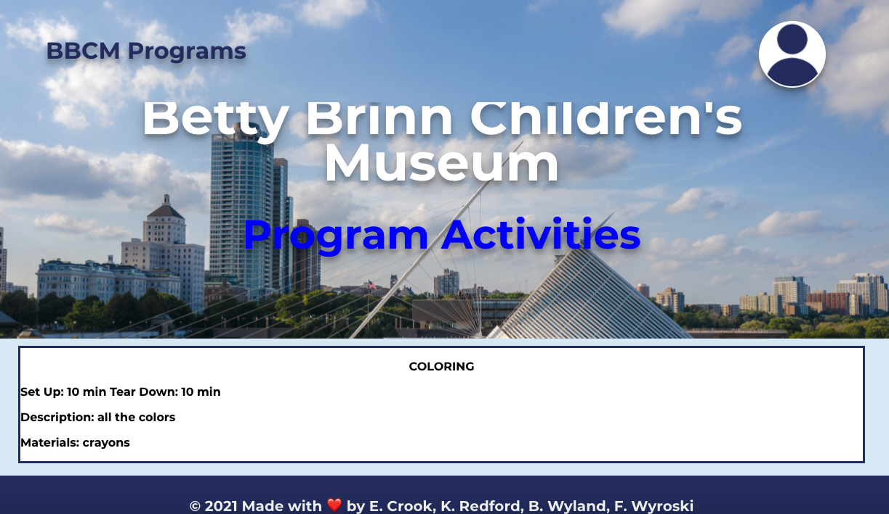
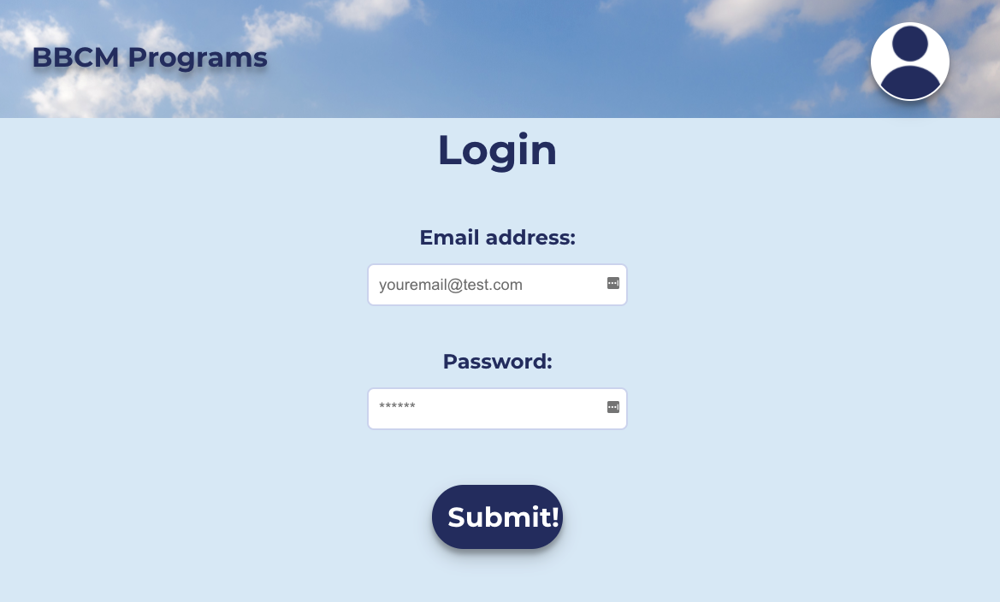
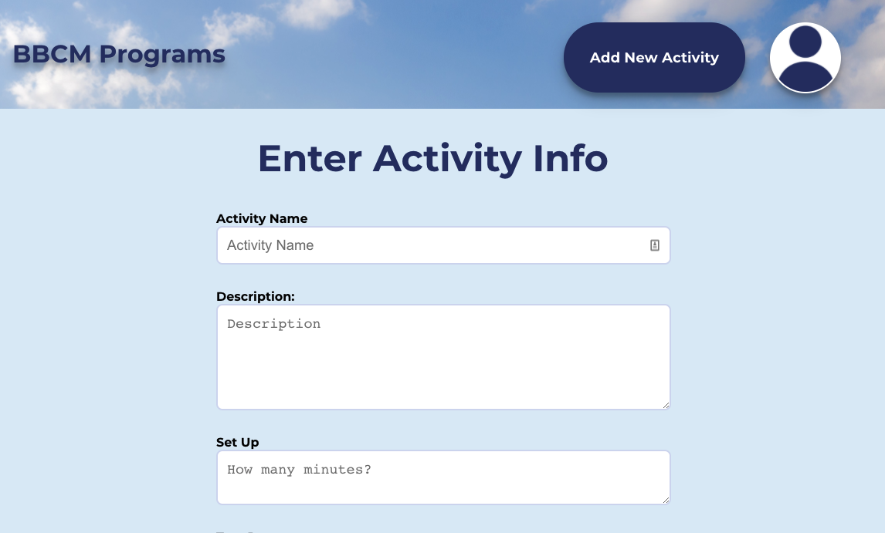

<h1 align='center'>BBCM.programsDB</h1>

###  * [Email me](mailto:katharine.redford@gmail.com) * 
  * [Deployed App Link](https://bbcm-programs.herokuapp.com/)
  * [Github Repo Link](https://github.com/katredford/BBCM.programsDB)
  

    
    
    
    </a>

  

    
    
    
    
    
   

## Table of contents
  * [Description](#Description)
  * [Usage Instructions](#Usage-Instructions)
  * [Questions](#Questions)
  * [Contributing](#Contributing)
  * [License](#License)
 
  # Description
  ##### [Back to Table of Contents](#Table-of-Contents)
MERN Application (An app that will allow Museum employees to enter their activity planned for the day, and then print it for their convenience)

  ## User Story
  ##### [Back to Table of Contents](#Table-of-Contents)
  AS A USER 
  I WANT to 
  (As museum worker, I wanted to have an app that I would be able to use along with my coworkers,  enter activities and print them
-When I log in to my account
-I am able to see previous activities
-I am able to enter my own (NEW) activity
-I am able to print my activity
)

  ## Installation Instructions
  ##### [Back to Table of Contents](#Table-of-Contents)
  * Requirements
      - Internet connection and any web browser
  * Step 1:
- Click on URL Link [here](https://github.com/katredford/BBCM.programsDB)

  ## Usage Instructions
  ##### [Back to Table of Contents](#Table-of-Contents)
  * LOGIN:
- Enter your email and password to Login
    * ADD ACTIVITY:
- Steps to add, save and view/print Activity
(ADD STEPS AND SNAPSHOTS)
  * Step 1:
    - *Home Page*

    

    * Step 2:

- *Login*

    

  * Step 3:
       
- *Add Activity*

    

 

  ## Contributing
  ##### [Back to Table of Contents](#Table-of-Contents)

  ## Questions
  ##### [Back to Table of Contents](#Table-of-Contents)
  * If you have any questions, please contact me at *katharine.redford@gmail.com*

  ## License 
  ##### [Back to Table of Contents](#Table-of-Contents)
  * License Type: MIT
    
    [License: MIT](https://opensource.org/licenses/MIT)
    Permission is hereby granted, free of charge, to any person obtaining a copy of this software and associated documentation files (the "Software"), to deal in the Software without restriction, including without limitation the rights to use, copy, modify, merge, publish, distribute, sublicense, and/or sell copies of the Software, and to permit persons to whom the Software is furnished to do so, subject to the following conditions:The above copyright notice and this permission notice shall be included in all copies or substantial portions of the Software.THE SOFTWARE IS PROVIDED "AS IS", WITHOUT WARRANTY OF ANY KIND, EXPRESS OR IMPLIED, INCLUDING BUT NOT LIMITED TO THE WARRANTIES OF MERCHANTABILITY, FITNESS FOR A PARTICULAR PURPOSE AND NONINFRINGEMENT. IN NO EVENT SHALL THE AUTHORS OR COPYRIGHT HOLDERS BE LIABLE FOR ANY CLAIM, DAMAGES OR OTHER LIABILITY, WHETHER IN AN ACTION OF CONTRACT, TORT OR OTHERWISE, ARISING FROM, OUT OF OR IN CONNECTION WITH THE SOFTWARE OR THE USE OR OTHER DEALINGS IN THE SOFTWARE.

